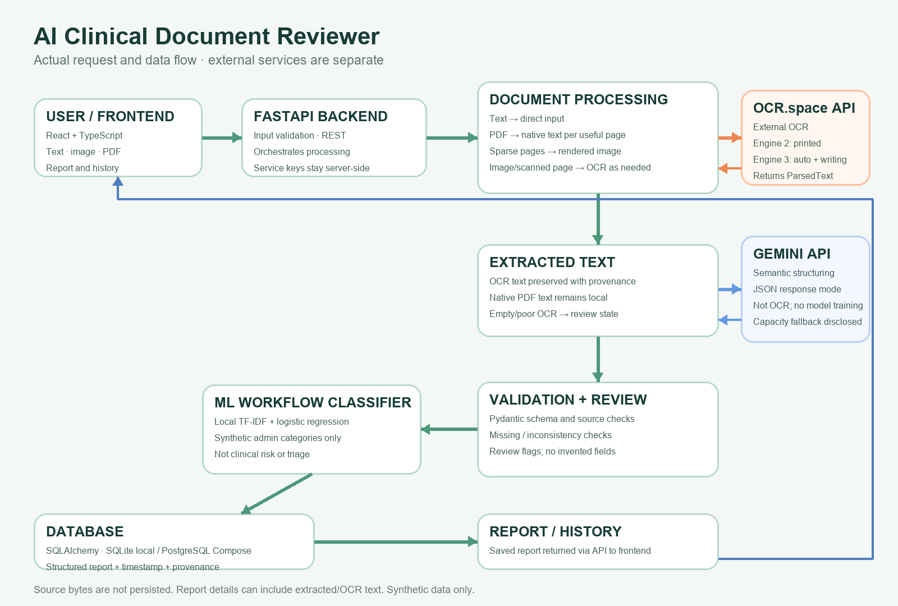

# AI Clinical Document Reviewer

A local-first documentation review prototype. It extracts source-supported clinical details, highlights missing or conflicting information, preserves clinically relevant unclassified text for review, records non-clinical agreement and payment terms in a dedicated administrative section, assigns an administrative document-workflow category, and saves reports. Fields remain empty when a document does not support them; demographics are not used as a catch-all. It does not diagnose, assess medical urgency, or recommend treatment. Use synthetic documents only.

## What it does

- Accepts text, images (PNG, JPG/JPEG, WEBP, TIFF, BMP), and PDFs up to the configured upload limit.
- Extracts usable PDF text with PyMuPDF; renders sparse/scanned pages and sends them, plus images, to OCR.space. Printed mode uses Engine 2; automatic/handwritten mode uses Engine 3. OCR text and provenance are recorded; OCR.space does not provide a confidence value here, so confidence remains unavailable rather than fabricated.
- Runs source-matched clinical extraction, optional Gemini structured refinement, schema/source grounding checks, deterministic missing/inconsistency checks, then the local synthetic workflow classifier.
- Saves the structured report and processing metadata to SQLite locally or PostgreSQL in Compose; exposes history and report detail APIs.
- Presents an animated responsive React dashboard with upload, report, and history views. Motion reports request-level state only; it does not invent OCR/AI substep progress.

## Technology and repository structure

| Area | Technology |
|---|---|
| Frontend | React, TypeScript, Vite, Framer Motion |
| API | FastAPI, Pydantic, SQLAlchemy |
| PDF/OCR | PyMuPDF native extraction and page rendering; OCR.space API |
| Semantic extraction | Optional server-side Gemini; deterministic source-grounded baseline |
| Workflow classifier | Small locally trained TF-IDF + multinomial logistic regression, synthetic examples only |
| Persistence | SQLite local; PostgreSQL in Docker Compose |
| CI | GitHub Actions: Ruff, pytest, synthetic evaluation, ESLint, Vitest, TypeScript/Vite build |

```text
frontend/src/                 React dashboard and report views
frontend/public/              Workflow illustration and static assets
backend/app/api/              FastAPI report and health endpoints
backend/app/core/             Environment-backed configuration
backend/app/db/               SQLAlchemy setup
backend/app/models/           Persisted report model
backend/app/schemas/          Pydantic request/report contracts
backend/app/services/         Processing, OCR, extraction, validation, AI
backend/tests/                Synthetic unit and API tests
backend/ml/                   Synthetic classifier data, training and inference
sample-data/synthetic/        Synthetic examples only
docs/                         Architecture, AI/ML design, decisions, diagram
.github/workflows/ci.yml      CI workflow
```

## Architecture and data flow

```text
Browser text / image / PDF
  → React frontend → FastAPI
  → text: direct; PDF: native text per page when useful
  → image/scanned page: OCR.space Engine 2 or Engine 3
  → source-grounded extraction → optional Gemini semantic structuring
  → Pydantic + source checks → missing/inconsistency checks
  → synthetic administrative workflow classifier → SQL database
  → report/history API → frontend
```

See [architecture](docs/architecture.md), [AI/ML design](docs/ai-ml-design.md), and [technical decisions](docs/technical-decisions.md).



## Local setup

Requirements: Python 3.11+, Node.js 22+, and outbound network access for OCR.space/Gemini. The hosted application is not live yet. A free-tier Vercel + Render deployment blueprint is prepared, but provider sign-in and API/database configuration are still required.

### Backend

```powershell
cd backend
python -m venv .venv
.venv\Scripts\Activate.ps1
python -m pip install -r requirements-dev.txt
Copy-Item .env.example .env
```

Edit `backend/.env` with your own backend-only credentials. Do not commit it. The `.env.example` values are placeholders and are not usable keys.

```dotenv
DATABASE_URL=sqlite:///./clinical_reviews.db
OCR_SPACE_API_KEY=your-ocr-space-key
GEMINI_API_KEY=your-gemini-key
GEMINI_MODEL=gemini-3.8-flash
GEMINI_FALLBACK_MODEL=gemini-3.6-flash
```

Then run:

```powershell
python -m ml.prepare_data
python -m ml.train
uvicorn app.main:app --reload
```

API: `http://localhost:8000`; OpenAPI: `http://localhost:8000/docs`; health: `http://localhost:8000/health`. If OCR.space is not configured, OCR-required uploads fail clearly. When Gemini is unavailable at capacity, the API saves a marked, source-grounded deterministic report requiring review; other malformed/provider errors fail rather than showing a successful AI-refined report.

### Frontend

In another terminal:

```powershell
cd frontend
npm ci
npm run dev
```

Open [http://localhost:5173](http://localhost:5173). The API base defaults to `http://localhost:8000`; set `VITE_API_URL` at frontend build time to use another API origin. Never put OCR/Gemini credentials in `VITE_*` variables.

### Environment variables

| Variable | Default | Purpose |
|---|---|---|
| `DATABASE_URL` | `sqlite:///./clinical_reviews.db` | SQLAlchemy database URL |
| `MAX_UPLOAD_MB` | `10` | Upload size limit |
| `CORS_ORIGINS` | `http://localhost:5173` | Comma-separated allowed browser origins |
| `OCR_SPACE_API_KEY` | empty | Server-only OCR.space key; required for image/scanned PDF OCR |
| `GEMINI_API_KEY` | empty | Server-only Gemini key; optional semantic structuring |
| `GEMINI_MODEL` | `gemini-3.8-flash` | Preferred Gemini model configured by this project |
| `GEMINI_FALLBACK_MODEL` | `gemini-3.6-flash` | Temporary capacity fallback model |
| `OPENAI_API_KEY` | empty | Optional legacy provider fallback when Gemini is not configured |
| `OPENAI_MODEL` | `gpt-4o-mini` | OpenAI fallback model |
| `VITE_API_URL` | `http://localhost:8000` | Public API base URL embedded in frontend build |
| `POSTGRES_PASSWORD` | compose demo value | Local Compose database password; replace before use |

## Database and containers

Direct backend setup uses SQLite and creates its database relative to the backend working directory. Docker Compose uses PostgreSQL 16 and serves the site at `http://localhost:8080`:

```powershell
Copy-Item .env.example .env
# Set a non-demo POSTGRES_PASSWORD and backend API credentials in .env
docker compose up --build
```

Compose injects OCR/Gemini keys into the backend container only; they are not frontend build arguments. Review the compose environment before deployment and provide secrets through the deployment platform, not a committed `.env`. The schema currently uses SQLAlchemy `create_all`; there is no migration framework.

## Tests and CI

```powershell
cd backend
python -m pip install -r requirements-dev.txt
python -m ml.prepare_data
python -m ml.train
python -m ruff check app tests evaluate.py ml
python -m pytest -q
python evaluate.py

cd ..\frontend
npm ci
npm run lint
npm test -- --run
npm run build
```

The tests use synthetic data and mocked external-service responses; they do not prove provider uptime or natural handwriting accuracy. `.github/workflows/ci.yml` runs backend and frontend checks on pushes/PRs. Verify its hosted run after a GitHub push. CI is configured; hosting still requires provider account authorization and private provider secrets.

## Hosted assignment deployment

Free-tier topology: Vercel serves the React SPA; Render runs FastAPI and a 1 GB managed PostgreSQL database in Singapore. Vercel handles SPA deep links.

### Provisioning steps

1. Sign in to Render and connect the GitHub repo. Deploy the root render.yaml Blueprint. It creates a free FastAPI service and a free 1 GB PostgreSQL database. Enter OCR_SPACE_API_KEY, GEMINI_API_KEY, and CORS_ORIGINS in the protected setup form. Do not paste secrets into chat or commit them.
2. In Vercel, import sajid-da/deskfactor and set Root Directory to frontend. Set VITE_API_URL to the HTTPS Render service origin. It is public, not a secret. A production build rejects a missing, non-HTTPS, or localhost API URL.
3. Open the deployed frontend and verify /health, synthetic text submission, synthetic image/PDF OCR, structured report, ML output, and database persistence. Export any needed records before the free Render database expires after 30 days.

This app currently has no authentication or tenant isolation. Use synthetic records only; do not upload real patient documents. SQLAlchemy create_all initializes a new schema; Alembic migrations and database restore verification are not configured.

### Deployment status

No service is provisioned yet. There is no Vercel/Render CLI or deployment token in this environment, and the Vercel dashboard redirects to login. Provider sign-in and GitHub authorization must happen in your accounts. Free hosting has no service charge, but Render API sleeps after 15 minutes idle and the managed PostgreSQL expires after 30 days. Add secrets only in protected provider settings. Do not send passwords, API keys, or database URLs in chat.

## Screenshots/examples

The central workflow illustration is in `frontend/public/workflow-pipeline.png`. Synthetic text examples are under `sample-data/synthetic/`; generated OCR fixtures are under `backend/tests/fixtures/`. These images and notes are synthetic. Do not use actual patient files in screenshots, tests, or this demo.

## Limitations and safety

- OCR.space Engine 3 is not guaranteed to read every handwriting style, language, or low-quality scan. The available handwriting-style fixture is generated, not representative human penmanship. Always compare extracted values and prescription directions with the source.
- Gemini is a semantic structuring service, **not OCR**; source excerpt checks do not establish clinical correctness. Submitted text may be sent to Google when Gemini is enabled. Review the provider's data terms before using any sensitive data.
- Deterministic extraction is narrow, misses variants/context, and is not a clinical NLP system. The workflow classifier is trained on tiny synthetic administrative labels; scores are not calibrated clinical probabilities or risk/triage judgments.
- No authentication, tenant isolation, production privacy controls, encryption/retention policy, rate limiting, database migrations, or clinical validation is implemented. Use synthetic data only.
- Gemini capacity and external network/provider availability may vary. The current project has not been deployed or verified on a public host.

MIT License; see [LICENSE](LICENSE).
